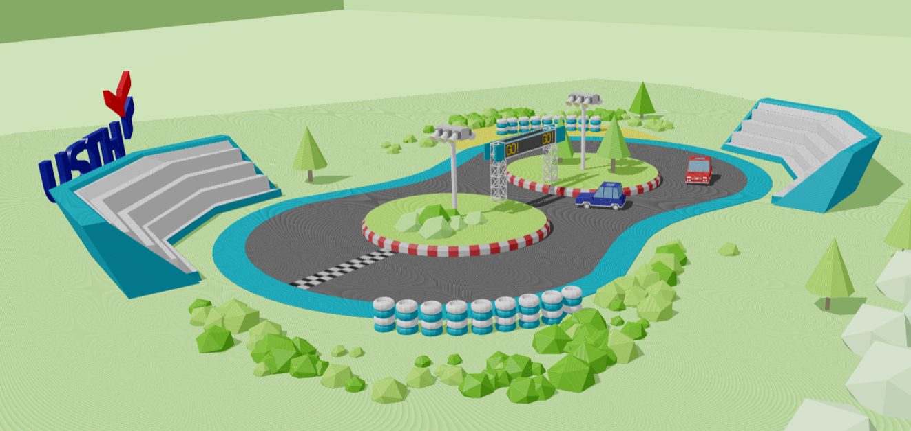
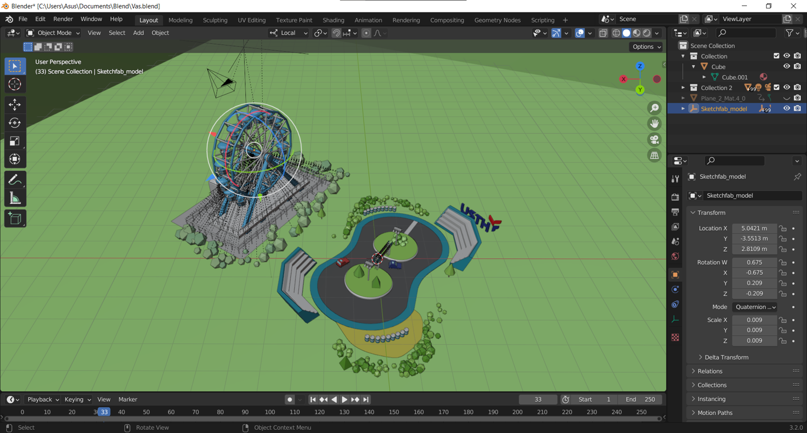
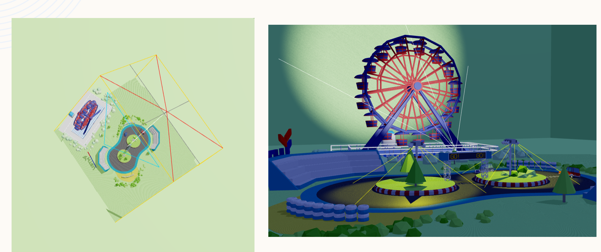
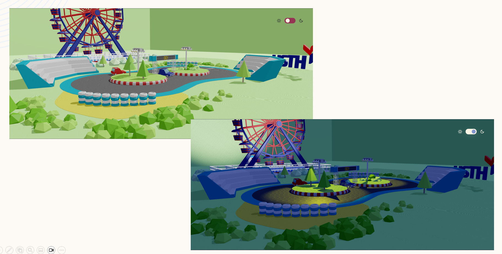
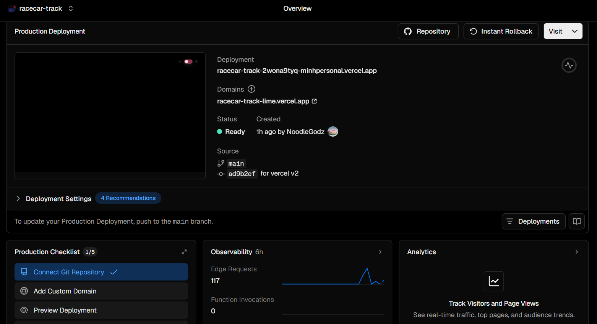

# Technical Assessment Report

## Racing Track Rendering Web Application

---

# 1. Executive Summary

This report presents a technical assessment of the **Racing Track Rendering** web application, an interactive 3D visualization developed using modern WebGL technologies. The system integrates Blender-based 3D content with a Three.js rendering engine and is deployed as a web application through Vercel. The project can be view in https://racecar-track-lime.vercel.app/.

The application demonstrates a complete browser-based graphics pipeline, including 3D asset loading, animation playback, dynamic lighting, shadow rendering, user interaction, and real-time rendering. The project adopts a modular architecture that separates rendering, resource management, scene management, and user interaction, resulting in a maintainable and extensible codebase.


---

# 2. System Overview

The application consists of three major components:

- **Content Creation**
  - Blender
  - GLB asset export

- **Rendering Engine**
  - Three.js
  - WebGL

- **Deployment**
  - Vite
  - Vercel

The workflow is illustrated below.

```
Blender scene creation
      │
      ▼
GLB Export
      │
      ▼
Three.js Loader
      │
      ▼
Scene Initialization
      │
      ▼
HTML embedding
      │
      ▼
Vite Bulid
      │
      ▼
Vercel Deployment
      │
      ▼
WebGL Rendering
      │
      ▼
Browser
```

---

# 3. Technology Stack

| Component | Technology |
|------------|------------|
| Programming Language | JavaScript (ES6 Modules) |
| Graphics API | WebGL |
| Rendering Library | Three.js |
| 3D Modeling | Blender |
| Model Format | GLB (glTF Binary) |
| Build Tool | Vite |
| Deployment | Vercel |
| Version Control | Git |

---

# 4. Software Architecture

The application follows a modular architecture where each component is responsible for a specific subsystem.

```
Application
│
├── Utils
│   ├── assets.js
│   ├── Resources.js
│   ├── Sizes.js
│   └── Time.js 
│ 
├── World
│   ├── Environment.js
│   ├── Room.js
│   └── World.js
│
├── Camera.js
│
├── Experience.js
│
├── Renderer.js
│
├── Theme.js
│
└── main.js
```

### Responsibilities

**Renderer**

- WebGL renderer initialization
- Render loop execution
- Shadow rendering

**Scene**

- Scene graph management
- Object hierarchy

**Camera**

- Perspective camera
- Orbit controls
- View updates

**Resources**

- GLB loading
- Texture loading
- Asset caching

**World**

- Scene objects
- Animation initialization
- Lighting configuration

**Theme**

- Day/Night switching
- Material updates
- Lighting adjustments

---

# 5. Rendering Pipeline

The rendering process executes continuously using the browser animation loop.

```
Initialize Scene
       │
       ▼
Load Assets
       │
       ▼
Create Camera
       │
       ▼
Initialize Lights
       │
       ▼
Animation Update
       │
       ▼
Process User Input
       │
       ▼
Render Scene
       │
       ▼
Display Frame
```

Each frame performs the following operations:

1. Process keyboard events.
2. Update animation states.
3. Update object transformations.
4. Update lighting.
5. Render the scene.
6. Request the next animation frame.

---

# 6. Asset Management

The project stores the entire environment as GLB files exported from Blender.

Advantages include:

- Binary asset format
- Embedded textures
- Embedded materials
- Embedded animations
- Faster loading
- Smaller file size than text-based glTF

The loading pipeline uses:

- GLTFLoader
- Scene graph traversal
- Material initialization
- Animation extraction

---

# 7. Scene Graph Management

After loading, the application traverses the scene hierarchy to identify important objects such as:

- Racing track
- Vehicle
- Ferris wheel
- Decorative objects
- Light sources

Each object is configured individually for:

- Shadow casting
- Shadow receiving
- Material updates
- Animation playback

The hierarchical scene graph simplifies object management and improves maintainability.

---

# 8. Animation System

Animations created in Blender are imported together with the GLB model.

The application uses **Three.js AnimationMixer** to manage animation playback.

The animation subsystem supports:

- Clip playback
- Time synchronization
- Continuous looping
- Playback speed adjustment

Animation timing is updated every rendering frame using the elapsed time from the rendering clock.

---

# 9. Lighting System

The lighting implementation combines multiple light sources to improve scene realism.

Components include:

- Ambient Light
- Spot Light

The spotlight is configured to:

- Cast dynamic shadows
- Illuminate moving objects
- Enhance depth perception

The application also supports runtime switching between Day and Night lighting presets.


---

# 10. Camera System

The application uses a Perspective Camera combined with OrbitControls.

Capabilities include:

- Rotation
- Zoom
- Pan
- Window resize adaptation

The camera system remains independent from the rendering subsystem, improving modularity.

---

# 11. User Interaction

Keyboard events are processed through JavaScript event listeners.

| Key | Action |
|------|--------|
| Right Arrow | Increase speed |
| Left Arrow | Decrease speed |
| Space | Stop vehicle |
| R | Reset speed |

Input events modify application state rather than directly manipulating rendered objects.

---
# 12. Deployment Assessment

The application is deployed using **Vercel**.

**Live Application**

https://racecar-track-lime.vercel.app/

Deployment workflow:

```
Git Repository
        │
        ▼
Vercel Build
        │
        ▼
Production Bundle
        │
        ▼
Global CDN
        │
        ▼
Web Browser
```


---

# 13. Performance Assessment

Several implementation choices improve runtime performance.

## Efficient Asset Loading

GLB combines:

- Geometry
- Materials
- Textures
- Animations

into a single binary asset, reducing loading overhead.

## GPU Rendering

Three.js delegates rendering operations to WebGL, allowing geometry transformations and rasterization to execute on the GPU.

## Modular Updates

Only dynamic components such as animations and user interactions are updated every frame, while static scene elements remain unchanged.

## Optimized Build

Vite generates optimized production bundles through:

- Tree shaking
- Asset compression
- Code splitting
- Static asset optimization

---


---
# Demo

<!--  -->